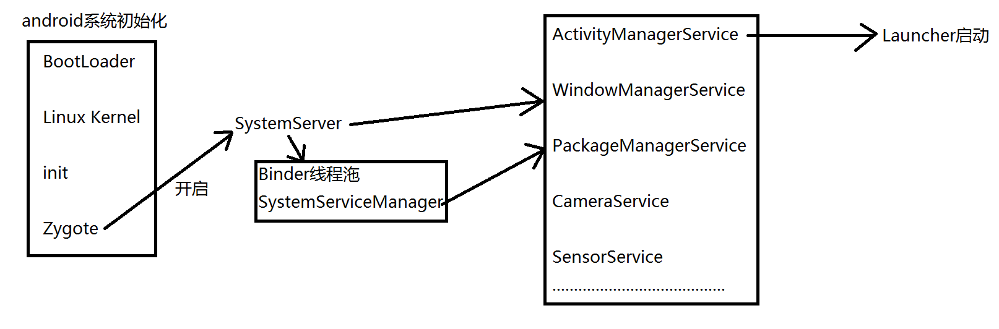
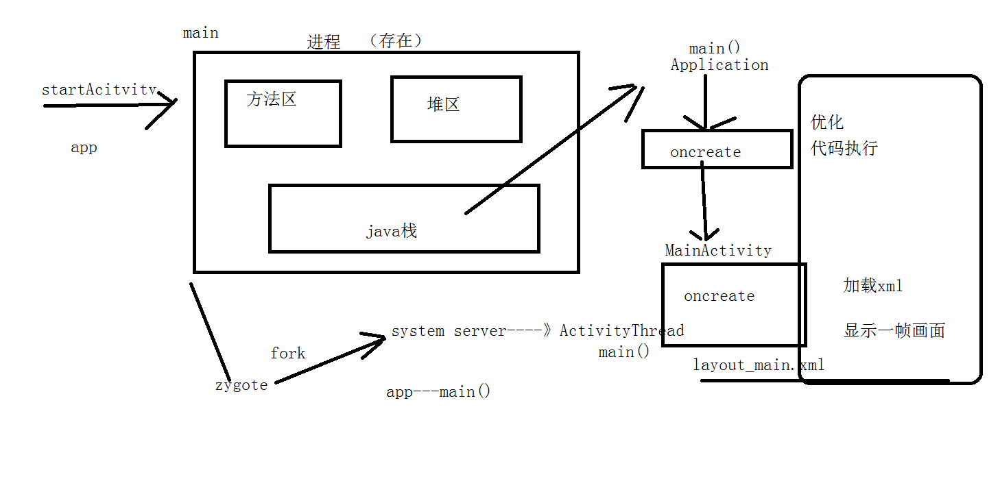
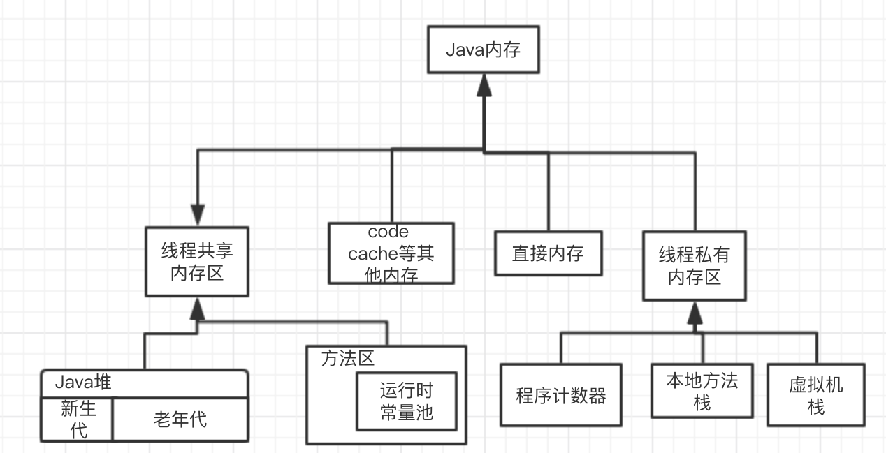

#App启动优化与内存优化

## 1. 启动优化

### 1.1 了解系统启动流程

1. 打开电源   引导芯片代码加载引导程序Boot Loader到RAM中去执行；
2. BootLoader把操作系统拉起来；
3. Linux 内核启动开始系统设置，找到一个init.rc文件启动初始化进程；
4. init进程初始化和启动属性服务，之后开启Zygote进程；
5. Zygote开始创建JVM并注册JNI方法，开启SystemServer；
6. 启动Binder线程沲和SystemServiceManager,并启动各种服务；
7. AMS启动Launcher；

### 1.2 application启动
> [launcher源码]{http://androidxref.com/4.4_r1/xref/packages/apps/Launcher2/src/com/android/launcher2/Launcher.java}

1. 当我们用手点击一个图标时，就到了这个类public final class Launcher extends Activity
   执行onClick(View view)方法，会把这个应用的相关信息传入
   先获取一个intent--->startActivitySafely(v, intent, tag)--》startActivity(v, intent, tag);-->startActivity(intent);
2. startActivity(intent)会开一个APP进程
3. ActivityThread.java做为入口     用attach开启app    再加载application和activity
   thread.attach(false);---》mgr.attachApplication(mAppThread)会通过远端进程去
   回调private void handleBindApplication(AppBindData data)
   						Application app = data.info.makeApplication(创建Application对象
    						mInstrumentation.callApplicationOnCreate(app);----》 app.onCreate();






### 1.3 黑白屏问题

#### 1.3.1 伪解决方法

```
1.设置背景或者图片
<item name="android:windowBackground">@color/colorPrimary</item>
```

```
2.背景透明
<item name="android:windowIsTranslucent">true</item>
```

```
3.背景置空且不预览
<item name="android:windowBackground">@null</item>
<item name="android:windowDisablePreview">true</item>
```

#### 1.3.2 分析代码执行时间

```
Debug.startMethodTracing("/sdcard/trace");
Debug.stopMethodTracing();
```

开线程/懒加载


## 2.内存优化

### 2.1 java内存模型



* 线程私有区域
* 共享数据区

### 2.1 GC机制

####2.1.1 回收时机

1.引用计数算法

> 给对象中添加一个引用计数器，每当有一个地方引用它时，计数器值就加1；当引用失效时，计数器值就减1；任何时刻计数器为0的对象就是不可能再被使用的。

2.可达性分析算法

> 从GC Roots（每种具体实现对GC Roots有不同的定义）作为起点，向下搜索它们引用的对象，可以生成一棵引用树，树的节点视为可达对象，反之视为不可达。

3.引用类型

* 强引用
* 软引用
* 弱引用

#### 2.1.2 怎么回收

* 标记清除法
* 复制算法
* 标记整理算法
* 分代回收算法

### 2.2 内存泄漏

原因：当应用不再需要这个对象，当仍未释放该对象的所有引用。

* Static 引用Activity/View
* Inner Classes(Activity中的内部类)
* 匿名内部类（Handler/AsyncTask）

### 2.3 内存抖动

内存频繁的分配与回收，（分配速度大于回收速度时）最终会产生OOM。

### 2.4 编码习惯

1. 不要使用比需求更占空间的基本数据类型；
2. 循环尽量用foreach,少用iterator,   自动装箱尽量少用；
3. 数据结构与算法的解度处理（ArrayMap）；
4. 枚举优化；
5. static   staticfinal的问题(内存申请)；
6. 字符串的连接尽量少用加号(+)；
7. 重复申请内存的问题（递归函数、读流直接在循环中new对象、onMeause()onLayout()方法中刷新UI ）；
8. 尽量使用IntentService,而不是Service；


//TODO
可达性分析算法 寻找根节点的方法

