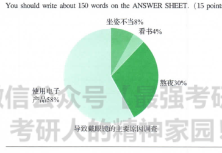

1. the factors that contribute to short sight
2. using electronic product
3. staying up late

   As can be seen from the pie chart above, major differences are detected in terms of the proportion of factors contributing to short sight among 
distinct groups. Based on the statistics of the chart, Using electronic product occupies the dominant position, accounting for 58%. Staying up late 
takes the percentage of 30%, ranging for the distant second. While reading comprises a relatively small proportion of 4%, coming to the last one.
   Obviously, a variety of complicated factors contribute to the phenomenon, with the following ones being the foremost. In the first place, as for 
student, it is a much strong desire rooted in their nature to relax themselves, correspondingly, playing electronic product enable them to relax 
their mind much easily. In other words, students excess use electronic product, which can partly account for the phenomenon shown in the chart. 
In the second place, learning burden has been increasing gradually in recent years, thus exerts a part impact on students' staying up late.