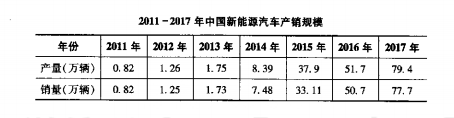

the yield of electric car
the sales of electric car
electric car

   As can be seen from the table chart above, remarkably similar trends between the yield of electric car and the sales of electric car 
are vividly demonstrated. There was a striking growth in the yield of electric car, from 82 thousand in 2011 to 794 thousand in 2017. 
At the meanwhile, the sales of electric car has undergone a significant growth during the same period, form 82 thousand to 777 thousand.
   protect environment