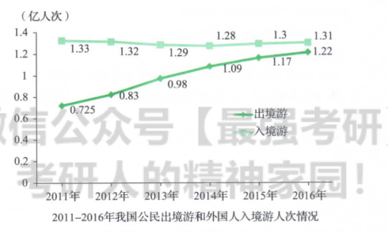

Chinese people choose to travel abroad
foreigner choose to travel in China

   As can be seen from the line graph above, remarkably different trends of the travel choice between Chinese people and foreigners are 
vividly demonstrated. There was a striking growth in the number of Chinese people choose to travel abroad, from 72.5 million in 2011 to 122 
million in 2017. At the meanwhile, as for the number of foreigners choose to travel in China, it almost remains stable at 131 million.
   Obviously, a variety of complicated factors contribute to the phenomenon, with the following ones being the foremost. In the first place, 
As for Chinese people, it is a much strong desire rooted in their nature to try something new, correspondingly, traveling abroad enables them 
to enjoy different scenery much easily. In other words, traveling abroad can precisely meet the need of people, which can partly account for 
the phenomenon shown in the chart. In the second place, the travel industry has been expanding significantly in recent years, thus providing 
people with a wide variety choices of travel in a reasonable price. Obviously, the travel industry also exerts a positive impact on people's 
choosing to travel abroad.
   Taking the aspects of both the Chinese people and the whole travel industry into account, we may make a reasonable prediction. It can be 
inferred that the number of Chinese people who choose to travel abroad is project to show an upward trend owing to the people's increasing demands 
and the development of the travel industry.

   descend
   gradual
   slight
   significant
   try something new
   