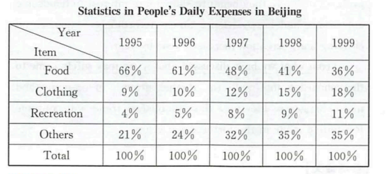

   As can be seen from the table chart above, major differences are detected in terms of the statistic of residents' daily expenditure in beijing among 
distinct groups. Based on the statistics of the chart, the food expenditure occupies the dominant position, accounting for 36%. The clothes expenditure 
takes up the percentage of 18%, ranging for the distant second. While  the clothes expenditure comprises the relatively small proportion of 10%, coming to 
the last one.