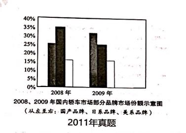

key:
the market share of different car
the market share of home-made car
the market share of Japanese car
the market share of American car

   As can be seen from the column chart above, remarkably different trends of the market share of different car 
are vividly demonstrated. There was a striking growth in the market share of home-made car, from 25% in 2008 to 
30% in 2009. At the meanwhile, the market share of Japanese car has undergone a striking decline during the same 
period, descending from 35% to 25%. As for the market share of American car, it almost remained stable at 12%.
   Obviously, a variety of complicated factors contribute to the phenomenon that more and more people begin to 
buy home-made car, with the following ones being the foremost. In the first place, as for Chinese people, it is a strong much desire 
rooted in their nature to own a car for traveling or commuting, correspondingly, local car manufactures enable them 
to buy a car in a reasonable price. In other words, the home-made cars can precisely meet the people who desire to own a 
car more easily, thus can partly account for the phenomenon shown in the chart. In the second place, Chinese car industry 
has been expanding significantly in recent years, thus providing Chinese people with a wide variety of car in a reasonable 
price. Obviously, the manufacturers' rapid development also exerts a positive impact on people's purchasing home-made car.