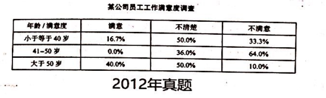

the satisfied degree in different age
people who less 40 years old
people who between 41 to 50
people who more than 50 years old

   从表格中可以看出，重要的差异被发现，根据不同群体之间对工作满意的比例。
   As can be seen from the table chart, major differences are detected in terms of the proportion of satisfaction with jobs 
among distinct groups. Based on the statistics of the chart, people between 41 and 50 years old who dissatisfied with jobs 
occupy the dominant position, accounting for 61%. People less than 40 years old who dissatisfied with jobs take up the 
percentage of 33%, ranging for the distant second. While people over 50 years old who dissatisfied with jobs comprise a 
relatively small proportion of 10%, coming to the last one.

   As can be seen from the table chart, major differences are detected in terms of the proportion of satisfaction with jobs among 
distinct groups. Based on the statistics of the chart, the people between 41 and 50 years old who dissatisfied with jobs occupy the 
dominant position, accounting for 60%. The people less than 40 years old who dissatisfied with jobs take the percentage of 33%, 
ranging for the distant second. While the people over 50 years old who dissatisfied with jobs comprise the relatively small proportion 
of 10%, coming to the last one.
   Obviously, a variety of complicated factors contribute to the phenomenon, with the following ones being the foremost. For one things, 
As for middle-aged people, it is a much strong desire rooted in their nature to possess a good life, correspondingly, good jobs enable 
them to enjoy their life more easily. In other words, bad jobs can not meet the needs of people who desire to own a relaxing life, which 
can partly accounting for the phenomenon shown in the chart. For another things, the middle-age's living pressure has been expanding gradually 
in recent years, thus exerting an impact on people's satisfaction with jobs.
   Taking the aspects of the people and the whole society, we may make a reasonable prediction. It can be inferred that the proportion of 
people's dissatisfaction with jobs is projected to show a downward trend owing to the improvement of social welfare.