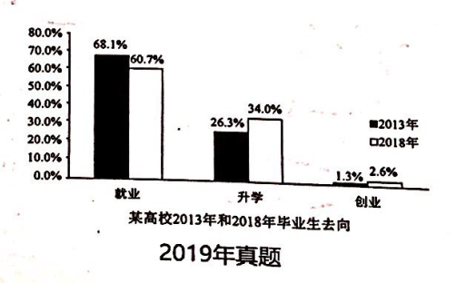

the future choices in graduates
the graduates choose to work
the graduates choose to explore a higher degree
the graduates choose to own their business

   As can be seen from the column chart above, remarkably different trends of the future choices in graduates are vividly demonstrated.
There was a gradual decline in the graduates choose to work, from 68.1% in 2018 to 60.7% in 2013. At the meanwhile, the graduates 
who choose to explore a higher degree has undergone a significant growth during the same period, from 26.3% to 34%. As for the graduates 
who choose to own their business almost remain stable under 3%.
   Obviously, a variety of complicated factors contribute to the phenomenon, with the following ones being the foremost.
As for graduates, it is a much strong desire rooted in their nature to possess a good future, correspondingly, owning a higher 
degree enables them to find a better job more easily. In other words, exploring a higher degree can precisely meet the needs of 
some graduates, which can partly account for the phenomenon shown in the chart. For second things, the employment stress has been 
raising slightly in recent years, thus exerting an impact on graduates' future choices.
    Taking the aspects of both graduates and the employment stress into account, we may make a reasonably prediction. It can be inferred 
that the proportion of the graduates who choose to work is projected to show an upward trend owing the improvement of industry in the future.