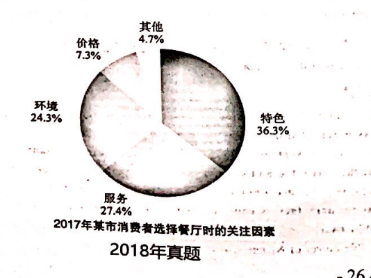

the factors what the restaurant customer attention to. 
restaurant
feature and service

   As can be seen from the pie chart above, major differences are detected in terms of the proportion of different factors of the restaurant 
customers' attention among distinct groups. Based on the statistics of the chart, the factor of features occupies the dominant 
position, accounting for 36%. The factor of service takes the percentage of 27%, ranging for the close second. While the factor of price comprises 
a relatively small proportion of 10%, coming to the last one.
   Obviously, a variety of complicated factors contribute to the phenomenon, with the following ones being the foremost. In the first place, 
As for customers, it is a strong much desire rooted in their nature to try something new, correspondingly, many restaurant enable them to get 
different experiences more easily. In other words, different restaurants can precisely meet the needs of customers who want to try something new, 
which can partly account for the phenomenon shown in the chart. For the second place, the restaurant industry has been expanding significantly 
in recent years, thus providing customers with a wide variety of products. Obviously, the restaurant industry's rapid development also exerts 
a positive impact on people's choosing.
    Taking the aspects of both the customers and the whole industry into account, we may make a reasonable prediction. It can be inferred that 
the proportion of factor of restaurant's feature is projected to show an upward trend owing to the customers's increasing demands and the improvement 
of the restaurant industry.