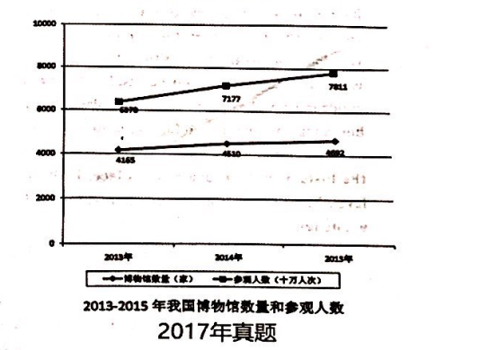

1. the quantity of museums and the quantity of people visiting museums

   As can be seen from the line graph above, remarkably similar trends of the quantity of museums and the quantify 
people visiting museums are vividly demonstrated. There was a gradual growth in quantity of museums visiting 
museums, from 43000 in 2013 to 5000 in 2017. At the meanwhile, the quantity of people visiting museums has undergone 
a significant growth during the same period, from 5000 million to 7000 million.
   Obviously, a variety of complicated factors contribute to the phenomenon, with the following ones being the foremost.
In the first place, as for tourists, it is a much strong desire rooted in their nature to acquire acknowledge and achieve 
a wider horizon, correspondingly, visiting museums enables them to explore the world and achieve knowledge more easily. 
In other words, visiting museums can precisely meet the needs of people, which can partly account for the phenomenon 
shown in the chart. In the second place, the museum industry has been expanding significantly in recent years, thus provide 
people with a wide variety of product. Obviously, the museum industry's rapid development also exerts a positive impact on 
people's choosing to visit museums.
   Taking the aspects of the visitor and the whole museum industry into account, we may make a reasonable prediction. 
It can be inferred that the quantity of people visiting museums is projected to show an upward trend owing to the people's 
increasing demands and the development of museum industry. 