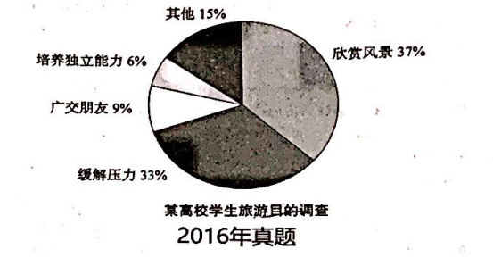

the proportion of purposes of college students' travel
enjoying the view
relaxing their mind

   As can be seen from the pie chart, major differences are detected in the proportion of purposes of college students' travel among 
distinct groups. Based on the statistics of the chart, the factor of enjoying the view takes the dominant position, accounting for 37%. 
The factor of relaxing their mind takes the percentage of 33%, ranging for the close second. 
    Obviously, a variety of complicated factors contribute to the phenomenon, with the following ones being the foremost. In the first 
place, as for college students, it is a much strong desire rooted in their nature to enjoy themselves, correspondingly, going out for 
travel enables them to enjoy the view and relax their mind more easily. In other words, the travel can precisely meet the needs of 
college students, which can partly account for the phenomenon shown in the chart. In the second place, the travel industry has been 
expanding significantly in recent years, thus provides students with a wide variety of products in a reasonable price. Obviously, the 
travel industry's rapid development also exerts a positive impact on students' going out for travel.
   Taking the aspects of the college student and the whole travel industry into account, we may make a reasonable prediction. It can be 
inferred that the proportion of enjoying the view is projected to show an upward trend owing to the tourists' increasing demands and 
the improvement of travel industry.