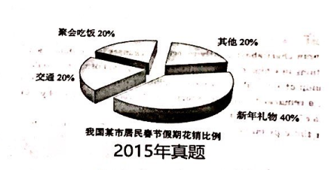

the proportion of expenditure during Spring day
expenditure of buying gift
expenditure of traffic and expenditure of attending parties

   As can be seen from the pie chart, major differences are detected in the proportion of expenditure during The Spring Day among distinct groups.
Based on the statistics of the chart, the expenditure of buying gift occupies the dominant position, accounting for 40%. The expenditure of traffic 
and the expenditure of attending parties takes the percentage of 20% separately, ranging for the distant second.
   Obviously, a variety of complicated factors contribute to the phenomenon, with the following ones being the foremost. In the first place, 
As for residents, it is a much strong desire rooted in their nature to have high-quality friendship, correspondingly, presenting gift enables them 
to shorten the distant with friends. In other words, presenting gift can precisely meet the needs of people, which can partly account for the 
phenomenon shown in the chart. In the second place, Chinese industry has been expanding significantly in recent years, thus providing people with 
a wide variety of gift product in a reasonable price. Obviously, the manufacturers' rapid development also exerts a positive impact on people's 
purchasing gifts. 
   Taking the aspects of resident and the whole industry into account, we may make a reasonable prediction. It can be inferred that the proportion of 
purchasing gifts is projected to show an upward trend owing to the people's increasing demands and the development of manufacturers.