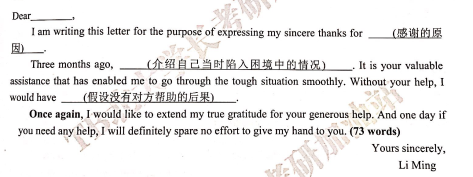
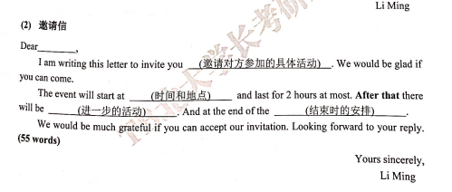
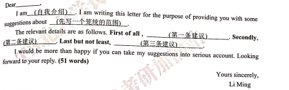
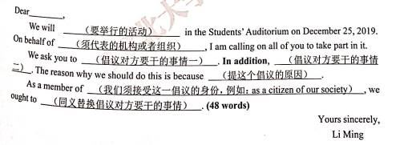
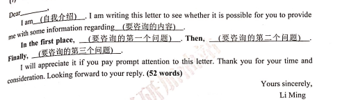
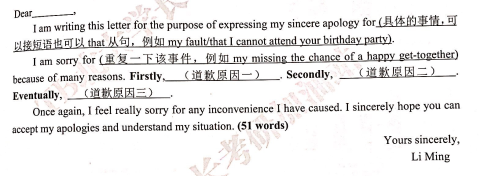
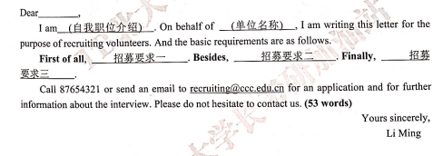

NOTICE
    This notice is to _______
    In the first place, _______. Secondly, __________. Eventually, ______.
    
    
Letter

summary：
1. I am writing this letter for the purpose of expressing _________.
2. It is ____ that ____

   Dear ___:
   I am writing this letter for the purpose of expressing my sincere thanks for ____. 
   Three months ago, ___________. It is your valuable assistance that has enabled me to go through the tough situation smoothly. 
Without your help, I would have _______.
    Once again, I would like to extend my true gratitude for your generous help. And one day if you need any help, I will definitely 
spare no effort to give my hand to you.

Dear___.
    I am writing this letter to invite you ______. We would be glad if you can come.
    The event will start at _______ and last for 2 hours at most. After that there will be ______. And at the end of the ________.
    We would be much grateful if you can accept our invitation. Looking forward to your reply.
                                                                                                        Your sincerely.
                                                                                                        Li Ming
                                                                                                        

