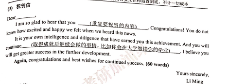

# 祝贺信

## 第一段
Dear ___,
    I am so glad to hear that you ____. Congratulations! You do not know how excited and happy felt when we heard this news.

# 感谢信
Dear ___:
   I am writing this letter for the purpose of expressing my sincere thanks for ____. 
   Three months ago, ___________. It is your valuable assistance that has enabled me to go through the tough situation smoothly. 
Without your help, I would have _______.

# 非感谢和祝贺

## 第一段
Dear ___,
   I am writing this letter to you to present my ___① for ___(原因). There was several ___② elaborating my ___① as follows.
   

①.suggestion/apology/resignation辞职/application申请/complaint/consulting/regret/gratitude/congratulation/request/proposal号召信/recommendation/invitation邀请
②.points/reasons/

例. 
I am writing this letter to you to present my suggestion for the quality of our library service. There was several points elaborating my 
suggestion as follows.

## 第二段
The most critical point/reason is that ___ . Additionally, ____. Lastly, _______.
 
## 第三段
My highly appreciation goes for your precious time from your busy schedule spent on this letter.
Your favorable response at your earliest convenience would be highly appreciated.  
                                                                                yours sincerely.  
                                                                                        Li Ming