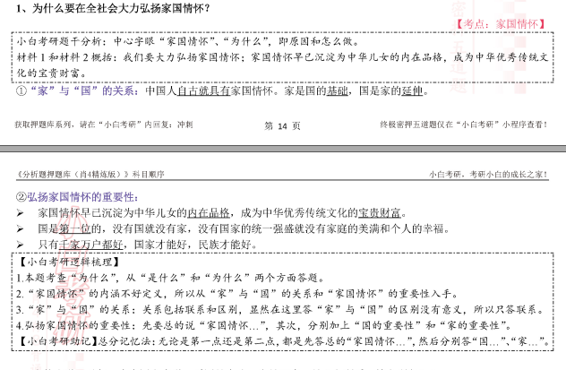
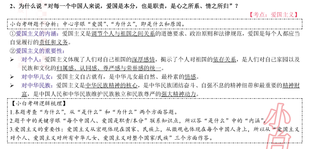
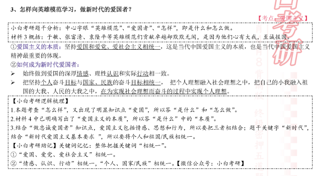

1. 自古就有家国情怀，延伸、基础；
2. 沉淀为中华儿女的内在品格，是中华名族优秀传统文化的宝贵财富；
3. 没有国家的强盛就没有个人的幸福家庭的美满；
4. 只有千家万户好，国家才能好，民族才能好；

是什么：一道政法
对个人：个人对祖国的情感、依存关系，个人对祖国和民族文化的
对中华儿女：
对中华民族：心福利待

相统一
爱国爱党爱社会主义相统一
情感认识行动相统一
个人目标和国家的理想相统一，个人理想和社会理想

//家国情怀
1.自古就有
2.家国情怀早已沉淀为中华儿女的内在品德，是中华优秀传统文化的宝贵财富；
3.只有国家强，个人、家庭
4.千家万户好，国家、民族

//爱国的含义和原因
爱国主义是调节个人和祖国间的道德要求、政治原则、法律规范，爱国是每个中国人都应该履行的责任和义务；
爱国主义体现了个人对祖国强烈的情感，揭示了个人和祖国间的依存关系。
自古就有，是中华儿女最真挚和最朴素的情感；
爱国主义是中华民族精神的核心，是中华民族团结奋斗、自强不息的精神纽带和最重要的精神财富，是中华民族维护民族独立和民族尊严的精神动力；

//爱国怎么做
爱国爱党爱社会主义相统一
情感、认识、行动相统一
个人目标和国家目标相统一，个人理想融入社会理想

